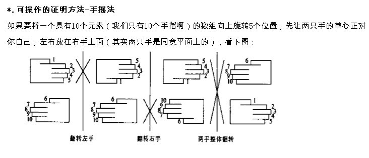

# 第一章：左旋转字符串

## 题目描述

定义字符串左旋转操作:把字符串前面的若干个字符移动到字符串尾部,如把字符串 abcdef 左旋转 2 位得到字符串 cdefab。请实现字符串左旋转的函数,要求对长度为 n 的字符串操作的时间复杂度为 O(n),空间复杂度为 O(1)。


## 解法一、暴力移位法
初看此题,最先想到的方法可能就是一位一位移动,姑且将此函数叫做 `left_shift_one(char *s, int n)` ，以完成左移动一位的功能

```c
void left_shift_one(char *s, int n)
{
    assert(s != NULL);
    char t = s[0];  //保存第一个字符
    for (int i = 1; i < n; i++)
    {
        s[i - 1] = s[i];
    }
    s[n - 1] = t;
}
```

若向左移 m 位,方法如下:

```c
void left_shift_m(char *s, int n, int m)
{
    while (m--)
    {
        left_shift_one(s, n);
    }
}
```

## 解法二、三步反转法

对于这个问题，换一个角度：

将一个字符串分成X和Y两个部分，在每部分字符串上定义反转操作，如X^T，即把X的所有字符反转（如，X="abc"，那么X^T="cba"），那么就得到下面的结论：(X^TY^T)^T=YX。显然这解决了字符串的反转问题。

例如字符串 abcdef ，若要让def翻转到abc的前头，只要按下述3个步骤操作即可：

1. 首先分为俩部分，X:abc，Y:def；
2. 将X反转，X->X^T，即得：abc->cba；将Y反转，Y->Y^T，即得：def->fed。
3. 反转上述得到的结果字符串X^TY^T，即字符串cbafed的两部分（cba和fed）给予反转，得到：cbafed->defabc，形式化表示为(X^TY^T)^T=YX，这就实现了整个反转。

是不是一目了然了？

在《编程珠玑》上也有这样一个类似的问题，它的解法同本思路一致，如下图所示：



代码可以这么写：
```c
//updated@caopengcs && July
//2014-1-6
void reverse(char *s,int from,int to)
{
    while (from < to)
    {
        char t = s[from];
        s[from++] = s[to];
        s[to--] = t;
    }
}

void leftshift(char *s,int n,int m)
{
    m %= n;               //若要左移动大于n位，那么和%n 是等价的
    reverse(s, 0, m - 1); //反转[0..m - 1]，套用到上面举的例子中，就是X->X^T，即 abc->cba
    reverse(s, m, n - 1); //反转[m..n - 1]，例如Y->Y^T，即 def->fed
    reverse(s, 0, n - 1); //反转[0..n - 1]，即如整个反转，(X^TY^T)^T=YX，即 cbafed->defabc。
}
```
