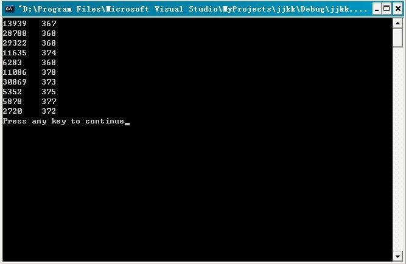

# 第三章续：Top K算法问题的实现

## 第一节、寻找最小的第k个数

进入本主题之前，先补充关于“寻找最小的第k个数”的三种简单实现方法。由于堆的完整实现，第三章：第五节，堆结构实现，处理海量数据中已经给出，下面主要给出类似快速排序中partition过程的代码实现：  

```c
//下面的代码对July博客中的三个版本代码进行重新改写。欢迎指出错误。
//先把它们贴在这里，还要进行随机化数据测试。待发...

//modified by 飞羽 at 2011.5.11
//Top_K_test

//修改了下命名规范，July、updated，2011.05.12。
#include <iostream>
#include <stdlib.h>
using namespace std;

inline int my_rand(int low, int high)
{
    int size = high - low + 1;
    return  low + rand() % size;
}

int partition(int array[], int left, int right)
{
    int pivot = array[right];
    int pos = left - 1;
    for (int index = left; index < right; index++)
    {
        if (array[index] <= pivot)
            swap(array[++pos], array[index]);
    }
    swap(array[++pos], array[right]);
    return pos; //返回pivot所在位置
}

bool median_select(int array[], int left, int right, int k)
{
    //第k小元素，实际上应该在数组中下标为k-1
    if (k - 1 > right || k - 1 < left)
        return false;

    //真正的三数中值作为枢纽元方法，关键代码就是下述六行
    int midIndex = (left + right) / 2;
    if (array[left] < array[midIndex])
        swap(array[left], array[midIndex]);
    if (array[right] < array[midIndex])
        swap(array[right], array[midIndex]);
    if (array[right] < array[left])
        swap(array[right], array[left]);
    swap(array[left], array[right]);

    int pos = partition(array, left, right);

    if (pos == k - 1)
        return true;
    else if (pos > k - 1)
        return median_select(array, left, pos - 1, k);
    else return median_select(array, pos + 1, right, k);
}

bool rand_select(int array[], int left, int right, int k)
{
    //第k小元素，实际上应该在数组中下标为k-1
    if (k - 1 > right || k - 1 < left)
        return false;

    //随机从数组中选取枢纽元元素
    int Index = my_rand(left, right);
    swap(array[Index], array[right]);

    int pos = partition(array, left, right);

    if (pos == k - 1)
        return true;
    else if (pos > k - 1)
        return rand_select(array, left, pos - 1, k);
    else return rand_select(array, pos + 1, right, k);
}

bool kth_select(int array[], int left, int right, int k)
{
    //直接取最原始的划分操作
    if (k - 1 > right || k - 1 < left)
        return false;

    int pos = partition(array, left, right);
    if (pos == k - 1)
        return true;
    else if (pos > k - 1)
        return kth_select(array, left, pos - 1, k);
    else return kth_select(array, pos + 1, right, k);
}

int main()
{
    int array1[] = {7, 8, 9, 54, 6, 4, 11, 1, 2, 33};
    int array2[] = {7, 8, 9, 54, 6, 4, 11, 1, 2, 33};
    int array3[] = {7, 8, 9, 54, 6, 4, 11, 1, 2, 33};

    int numOfArray = sizeof(array1) / sizeof(int);
    for (int i = 0; i < numOfArray; i++)
        printf("%d\t", array1[i]);

    int K = 9;
    bool flag1 = median_select(array1, 0, numOfArray - 1, K);
    bool flag2 = rand_select(array2, 0, numOfArray - 1, K);
    bool flag3 = kth_select(array3, 0, numOfArray - 1, K);
    if (!flag1)
        return 1;
    for (i = 0; i < K; i++)
        printf("%d\t", array1[i]);
    printf("\n");

    if (!flag2)
        return 1;
    for (i = 0; i < K; i++)
        printf("%d\t", array2[i]);
    printf("\n");

    if (!flag3)
        return 1;
    for (i = 0; i < K; i++)
        printf("%d\t", array3[i]);
    printf("\n");

    return 0;
}
```

说明：@飞羽：因为预先设定了K，经过分割算法后，数组肯定被划分为array[0...k-1]和array[k...length-1]，注意到经过Select_K_Version操作后，数组是被不断地分割的，使得比array[k-1]的元素小的全在左边，题目要求的是最小的K个元素，当然也就是array[0...k-1]，所以输出的结果就是前k个最小的数：

7 8 9 54  6 4 11  1 2 33
4 1 2 6 7 8 9 11  33
7 6 4 1 2 8 9 11  33
7 8 9 6 4 11  1 2 33

## 第二节、寻找最大的k个数
把之前第三章的问题，改几个字，即成为寻找最大的k个数的问题了，如下所述：  
**查找最大的k个元素**   
题目描述：输入n个整数，输出其中最大的k个。  
例如输入1，2，3，4，5，6，7和8这8个数字，则最大的4个数字为8，7，6和5。  

分析：由于寻找最大的k个数的问题与之前的寻找最小的k个数的问题，本质是一样的，所以，这里就简单阐述下思路，ok，考验你举一反三能力的时间到了：  

1. 排序，快速排序。我们知道，快速排序平均所费时间为n\*logn，从小到大排序这n个数，然后再遍历序列中后k个元素输出，即可，总的时间复杂度为O(n\*logn+k)=O(n\*logn)。  

2. 排序，选择排序。用选择或交换排序，即遍历n个数，先把最先遍历到得k个数存入大小为k的数组之中，对这k个数，利用选择或交换排序，找到k个数中的最小数kmin（kmin设为k个元素的数组中最小元素），用时O（k）（你应该知道，插入或选择排序查找操作需要O（k）的时间），后再继续遍历后n-k个数，x与kmin比较：如果x>kmin，则x代替kmin，并再次重新找出k个元素的数组中最大元素kmin‘（多谢jiyeyuran 提醒修正）；如果x<kmin，则不更新数组。这样，每次更新或不更新数组的所用的时间为O（k）或O（0），整趟下来，总的时间复杂度平均下来为：n\*O（k）=O（n\*k）。  

3. 维护k个元素的最小堆，原理与上述第2个方案一致，即用容量为k的最小堆存储最先遍历到的k个数，并假设它们即是最大的k个数，建堆费时O（k），并调整堆（费时O（logk））后，有k1>k2>...kmin（kmin设为小顶堆中最大元素）。继续遍历数列，每次遍历一个元素x，与堆顶元素比较，若x>kmin，则更新堆（用时logk），否则不更新堆。这样下来，总费时O（k\*logk+（n-k）\*logk）=O（n\*logk）。此方法得益于在堆中，查找等各项操作时间复杂度均为logk（不然，就如上述思路2所述：直接用数组也可以找出最大的k个元素，用时O（n\*k））。  

4. 按编程之美第141页上解法二的所述，类似快速排序的划分方法，N个数存储在数组S中，再从数组中随机选取一个数X，把数组划分为Sa和Sb俩部分，Sa>=X>=Sb，如果要查找的k个元素小于Sa的元素个数，则返回Sa中较大的k个元素，否则返回Sa中所有的元素+Sb中最大的k-|Sa|个元素。不断递归下去，把问题分解成更小的问题，平均时间复杂度为O（N）（编程之美所述的n\*logk的复杂度有误，应为O（N），特此订正。其严格证明，请参考第三章：[程序员面试题狂想曲：第三章、寻找最小的k个数、updated 10次](http://blog.csdn.net/v_JULY_v/article/details/6370650)）。  

其它的方法，在此不再重复了，同时，寻找最小的k个数借助堆的实现，代码在上一篇文章第三章已有给出，更多，可参考第三章，只要把最大堆改成最小堆，即可。  

## 第三节、Top K 算法问题
### 3.1、搜索引擎热门查询统计

**题目描述**：
搜索引擎会通过日志文件把用户每次检索使用的所有检索串都记录下来，每个查询串的长度为1-255字节。  <br/>
假设目前有一千万个记录（这些查询串的重复度比较高，虽然总数是1千万，但如果除去重复后，不超过3百万个。一个查询串的重复度越高，说明查询它的用户越多，也就是越热门。），请统计最热门的10个查询串，要求使用的内存不能超过1G。  

分析：这个问题在之前的这篇文章[十一、从头到尾彻底解析Hash表算法](http://blog.csdn.net/v_JULY_v/article/details/6256463)里，已经有所解答。方法是:    

**第一步**、对这批海量数据预处理，在O(N)的时间内用Hash表完成统计；  <br/>
**第二步**、借助堆这个数据结构，找出Top K，时间复杂度为N‘logK。  <br/>
即：借助堆结构，可以在log量级的时间内查找和调整/移动。因此，首先维护一个K(该题目中是10)大小的小根堆（K1>K2>....Kmin，Kmin设为堆顶元素），然后遍历300万的Query，分别和根元素Kmin进行对比（如上第2节思路3所述，若X>Kmin，则更新并调整堆，否则，不更新），我们最终的时间复杂度是：O(N) + N'\*O(logK)，（N为1000万，N’为300万）。ok，更多，详情，请参考原文。  

或者：采用trie树，关键字域存该查询串出现的次数，没有出现为0。最后用10个元素的最小推来对出现频率进行排序。  

本章实现这个问题时，为了降低实现上的难度，假设这些记录全部是一些英文单词，即用户在搜索框里敲入一个英文单词，然后查询搜索结果。要求统计输入单词中频率最大的前K个单词。当复杂问题简单化之后，编写代码也相对轻松多了，下图是简单示意图（绘制者，yansha）：  


**完整源码**：

```c
//copyright@yansha &&July
//July、updated，2011.05.08

//题目描述：
//搜索引擎会通过日志文件把用户每次检索使用的所有检索串都记录下来，每个查询串的
//长度为1-255字节。假设目前有一千万个记录（这些查询串的重复度比较高，虽然总数是1千万，但如果
//除去重复后，不超过3百万个。一个查询串的重复度越高，说明查询它的用户越多，也就是越热门），
//请你统计最热门的10个查询串，要求使用的内存不能超过1G。

#include <iostream>
#include <string>
#include <assert.h>
using namespace std;

#define HASHLEN 2807303
#define WORDLEN 30

// 结点指针
typedef struct node_no_space *ptr_no_space;
typedef struct node_has_space *ptr_has_space;
ptr_no_space head[HASHLEN];

struct node_no_space
{
    char *word;
    int count;
    ptr_no_space next;
};

struct node_has_space
{
    char word[WORDLEN];
    int count;
    ptr_has_space next;
};

// 最简单hash函数
int hash_function(char const *p)
{
    int value = 0;
    while (*p != '/0')
    {
        value = value * 31 + *p++;
        if (value > HASHLEN)
            value = value % HASHLEN;
    }
    return value;
}

// 添加单词到hash表
void append_word(char const *str)
{
    int index = hash_function(str);
    ptr_no_space p = head[index];
    while (p != NULL)
    {
        if (strcmp(str, p->word) == 0)
        {
            (p->count)++;
            return;
        }
        p = p->next;
    }

    // 新建一个结点
    ptr_no_space q = new node_no_space;
    q->count = 1;
    q->word = new char [strlen(str)+1];
    strcpy(q->word, str);
    q->next = head[index];
    head[index] = q;
}


// 将单词处理结果写入文件
void write_to_file()
{
    FILE *fp = fopen("result.txt", "w");
    assert(fp);

    int i = 0;
    while (i < HASHLEN)
    {
        for (ptr_no_space p = head[i]; p != NULL; p = p->next)
            fprintf(fp, "%s  %d\n", p->word, p->count);
        i++;
    }
    fclose(fp);
}

// 从上往下筛选，保持小根堆
void sift_down(node_has_space heap[], int i, int len)
{
    int min_index = -1;
    int left = 2 * i;
    int right = 2 * i + 1;

    if (left <= len && heap[left].count < heap[i].count)
        min_index = left;
    else
        min_index = i;

    if (right <= len && heap[right].count < heap[min_index].count)
        min_index = right;

    if (min_index != i)
    {
        // 交换结点元素
        swap(heap[i].count, heap[min_index].count);

        char buffer[WORDLEN];
        strcpy(buffer, heap[i].word);
        strcpy(heap[i].word, heap[min_index].word);
        strcpy(heap[min_index].word, buffer);

        sift_down(heap, min_index, len);
    }
}

// 建立小根堆
void build_min_heap(node_has_space heap[], int len)
{
    if (heap == NULL)
        return;

    int index = len / 2;
    for (int i = index; i >= 1; i--)
        sift_down(heap, i, len);
}

// 去除字符串前后符号
void handle_symbol(char *str, int n)
{
    while (str[n] < '0' || (str[n] > '9' && str[n] < 'A') || (str[n] > 'Z' && str[n] < 'a') || str[n] > 'z')
    {
        str[n] = '/0';
        n--;
    }

    while (str[0] < '0' || (str[0] > '9' && str[0] < 'A') || (str[0] > 'Z' && str[0] < 'a') || str[0] > 'z')
    {
        int i = 0;
        while (i < n)
        {
            str[i] = str[i+1];
            i++;
        }
        str[i] = '/0';
        n--;
    }
}

int main()
{
    char str[WORDLEN];
    for (int i = 0; i < HASHLEN; i++)
        head[i] = NULL;

    // 将字符串用hash函数转换成一个整数并统计出现频率
    FILE *fp_passage = fopen("string.txt", "r");
    assert(fp_passage);
    while (fscanf(fp_passage, "%s", str) != EOF)
    {
        int n = strlen(str) - 1;
        if (n > 0)
            handle_symbol(str, n);
        append_word(str);
    }
    fclose(fp_passage);

    // 将统计结果输入文件
    write_to_file();

    int n = 10;
    ptr_has_space heap = new node_has_space [n+1];

    int c;

    FILE *fp_word = fopen("result.txt", "r");
    assert(fp_word);
    for (int j = 1; j <= n; j++)
    {
        fscanf(fp_word, "%s %d", &str, &c);
        heap[j].count = c;
        strcpy(heap[j].word, str);
    }

    // 建立小根堆
    build_min_heap(heap, n);

    // 查找出现频率最大的10个单词
    while (fscanf(fp_word, "%s %d", &str, &c) != EOF)
    {
        if (c > heap[1].count)
        {
            heap[1].count = c;
            strcpy(heap[1].word, str);
            sift_down(heap, 1, n);
        }
    }
    fclose(fp_word);

    // 输出出现频率最大的单词
    for (int k = 1; k <= n; k++)
        cout << heap[k].count << " " << heap[k].word << endl;

    return 0;
}
```

**程序测试**：当用户输入单词后，搜索引擎记录结果，对“大量”单词记录进行统计（同时，令K=10，即找出10个最热门查询的单词）：  


**运行结果**：根据程序的运行结果，可以看到，搜索引擎记录下来的查询次数最多的10个单词为（注，并未要求这10个数要有序输出）：in（312次），it（384次），a（432），that（456），MPQ（408），of（504），and（624），is（456），the（1008），to（936）。  


**读者反馈from 杨忠胜**：3.1节的代码第38行 hash_function(char const \*p)有误吧，这样的话，不能修改p的值（但是函数需要修改指针的值），要想不修改\*p指向的内容，应该是const char \*p; 此外，您程序中的/t,  /n有误，C语言是\t,\n。  
&emsp;&emsp;感谢这位读者的来信，日后统一订正。谢谢。  

###3.2、统计出现次数最多的数据

**题目描述**：
面对上千万或上亿数据（有重复），统计其中出现次数最多的前N个数据。  

分析：上千万或上亿的数据，现在的机器的内存应该能存下（也许可以，也许不可以）。所以考虑采用hash_map/搜索二叉树/红黑树等来进行统计次数，之后取出前N个出现次数最多的数据了。当然，也可以堆实现。  

其实，此题与上题类似，最好的方法是用hash_map统计出现的次数，然后再借用堆找出出现次数最多的N个数据。不过，上一题统计搜索引擎最热门的查询已经采用过hash表统计单词出现的次数，特此，本题改用红黑树取代之前的用hash表，来完成最初的统计，然后用堆更新，找出出现次数最多的前N个数据。  

**完整代码**：

```c
//copyright@ zhouzhenren &&July
//July、updated，2011.05.08.

//题目描述：
//上千万或上亿数据（有重复），统计其中出现次数最多的前N个数据

//解决方案：
//1、采用红黑树（本程序中有关红黑树的实现代码来源于@July）来进行统计次数。
//2、然后遍历整棵树，同时采用最小堆更新前N个出现次数最多的数据。

//声明：版权所有，引用必须注明出处。
#define PARENT(i) (i)/2
#define LEFT(i)   2*(i)
#define RIGHT(i)  2*(i)+1

#include <stdio.h>
#include <stdlib.h>
#include <string.h>

typedef enum rb_color{ RED, BLACK }RB_COLOR;
typedef struct rb_node
{
    int key;
    int data;
    RB_COLOR color;
    struct rb_node* left;
    struct rb_node* right;
    struct rb_node* parent;
}RB_NODE;

RB_NODE* RB_CreatNode(int key, int data)
{
    RB_NODE* node = (RB_NODE*)malloc(sizeof(RB_NODE));
    if (NULL == node)
    {
        printf("malloc error!");
        exit(-1);
    }

    node->key = key;
    node->data = data;
    node->color = RED;
    node->left = NULL;
    node->right = NULL;
    node->parent = NULL;

    return node;
}

/**
* 左旋
*
*  node           right
*  / /    ==>     / /
* a  right     node  y
*     / /       / /
*     b  y     a   b
*/
RB_NODE* RB_RotateLeft(RB_NODE* node, RB_NODE* root)
{
    RB_NODE* right = node->right;    // 指定指针指向 right<--node->right

    if ((node->right = right->left))
        right->left->parent = node;  // 好比上面的注释图，node成为b的父母

    right->left = node;   // node成为right的左孩子

    if ((right->parent = node->parent))
    {  
        if (node == node->parent->right)
            node->parent->right = right;
        else  
            node->parent->left = right;
    }
    else
        root = right;

    node->parent = right;  //right成为node的父母

    return root;
}

/**
* 右旋
*
*      node            left
*       / /             / /
*     left y   ==>     a  node
*     / /                  / /
*    a   b                b   y
*/
RB_NODE* RB_RotateRight(RB_NODE* node, RB_NODE* root)
{
    RB_NODE* left = node->left;

    if ((node->left = left->right))
        left->right->parent = node;

    left->right = node;

    if ((left->parent = node->parent))
    {
        if (node == node->parent->right)
            node->parent->right = left;
        else
            node->parent->left = left;
    }
    else
        root = left;

    node->parent = left;

    return root;
}

/**
* 红黑树的3种插入情况
* 用z表示当前结点, p[z]表示父母、p[p[z]]表示祖父, y表示叔叔.
*/
RB_NODE* RB_Insert_Rebalance(RB_NODE* node, RB_NODE* r
{
    RB_NODE *parent, *gparent, *uncle, *tmp;  //父母p[z]、祖父p[p[z]]、叔叔y、临时结点*tmp

    while ((parent = node->parent) && parent->color == RED)
    { // parent 为node的父母，且当父母的颜色为红时
        gparent = parent->parent;   // gparent为祖父

        if (parent == gparent->left)  // 当祖父的左孩子即为父母时,其实上述几行语句，无非就是理顺孩子、父母、祖父的关

            uncle = gparent->right; // 定义叔叔的概念，叔叔y就是父母的右孩子。
            if (uncle && uncle->color == RED) // 情况1：z的叔叔y是红色的
            {
                uncle->color = BLACK;   // 将叔叔结点y着为黑色
                parent->color = BLACK;  // z的父母p[z]也着为黑色。解决z，p[z]都是红色的问题。
                gparent->color = RED;
                node = gparent;     // 将祖父当做新增结点z，指针z上移俩层，且着为红色。
                // 上述情况1中，只考虑了z作为父母的右孩子的情况。
            }
            else                     // 情况2：z的叔叔y是黑色的，
            {
                if (parent->right == node)  // 且z为右孩子
                {
                    root = RB_RotateLeft(parent, root); // 左旋[结点z，与父母结点]
                    tmp = parent;
                    parent = node;
                    node = tmp;     // parent与node 互换角色
                }
                // 情况3：z的叔叔y是黑色的，此时z成为了左孩子。
                // 注意，1：情况3是由上述情况2变化而来的。
                // ......2：z的叔叔总是黑色的，否则就是情况1了。
                parent->color = BLACK;   // z的父母p[z]着为黑色
                gparent->color = RED;    // 原祖父结点着为红色
                root = RB_RotateRight(gparent, root); // 右旋[结点z，与祖父结点]
            }
        }

        else
        {
            // 这部分是特别为情况1中，z作为左孩子情况，而写的。
            uncle = gparent->left;  // 祖父的左孩子作为叔叔结点。[原理还是与上部分一样的]
            if (uncle && uncle->color == RED)  // 情况1：z的叔叔y是红色的
            {
                uncle->color = BLACK;
                parent->color = BLACK;
                gparent->color = RED;
                node = gparent;           // 同上
            }
            else                               // 情况2：z的叔叔y是黑色的，
            {
                if (parent->left == node)  // 且z为左孩子
                {
                    root = RB_RotateRight(parent, root);  // 以结点parent、root右旋
                    tmp = parent;
                    parent = node;
                    node = tmp;       // parent与node 互换角色
                }
                // 经过情况2的变化，成为了情况3.
                parent->color = BLACK;
                gparent->color = RED;
                root = RB_RotateLeft(gparent, root);   // 以结点gparent和root左旋
            }
        }
    }

    root->color = BLACK; // 根结点，不论怎样，都得置为黑色。
    return root;      // 返回根结点。
}

/**
* 红黑树查找结点
* rb_search_auxiliary：查找
* rb_node_t* rb_search：返回找到的结点
*/
RB_NODE* RB_SearchAuxiliary(int key, RB_NODE* root, RB_NODE** save)
{
    RB_NODE* node = roo
    RB_NODE* parent = NULL;
    int ret;

    while (n
    {
        parent = node;
        ret = node->key - key;
        if (0 < ret)
            node = node->left;
        else if (0 > ret)
            node = node->right;
        else
            return node;
    }

    if (save)
        *save = parent;

    return NULL;
}

/**
* 返回上述rb_search_auxiliary查找结果
*/
RB_NODE* RB_Search(int key, RB_NODE* root)
{
    return RB_SearchAuxiliary(key, root, NULL);
}

/**
* 红黑树的插
*/
RB_NODE* RB_Insert(int key, int data, RB_NODE* root)
{
    RB_NODE* parent = NUL
    RB_NODE* node = NULL;

    parent = NULL;
    if ((node = RB_SearchAuxiliary(key, root, &parent)))  // 调用RB_SearchAuxiliary找到插入结点的地方
    {
        node->data++; // 节点已经存在data值
        return root;
    }

    node = RB_CreatNode(key, data);  // 分配结点
    node->parent = parent;

    if (parent)
    {
        if (parent->key > key)
            parent->left = node;
        else
            parent->right = node;
    }
    else
    {
        root = node;
    }

    return RB_Insert_Rebalance(node, root);   // 插入结点后，调用RB_Insert_Rebalance修复红黑树的性质
}

typedef struct rb_heap
{
    int key;
    int data;
}RB_HEAP;
const int heapSize = 10;
RB_HEAP heap[heapSize+1];

/**
* MAX_HEAPIFY函数对堆进行更新，使以i为根的子树成最大堆
*/
void MIN_HEAPIFY(RB_HEAP* A, const int& size, int i)
{
    int l = LEFT(i);
    int r = RIGHT(i);
    int smallest = i;

    if (l <= size && A[l].data < A[i].data)
        smallest = l;
    if (r <= size && A[r].data < A[smallest].data)
        smallest = r;

    if (smallest != i)
    {
        RB_HEAP tmp = A[i];
        A[i] = A[smallest];
        A[smallest] = tmp;
        MIN_HEAPIFY(A, size, smallest);
    }
}

/**
* BUILD_MINHEAP函数对数组A中的数据建立最小堆
*/
void BUILD_MINHEAP(RB_HEAP* A, const int& size)
{
    for (int i = size/2; i >= 1; --i)
        MIN_HEAPIFY(A, size, i);
}


/*
3、维护k个元素的最小堆，原理与上述第2个方案一致，
即用容量为k的最小堆存储最先在红黑树中遍历到的k个数，并假设它们即是最大的k个数，建堆费时O（k），
然后调整堆（费时O（logk））后，有k1>k2>...kmin（kmin设为小顶堆中最小元素）。
继续中序遍历红黑树，每次遍历一个元素x，与堆顶元素比较，若x>kmin，则更新堆（用时logk），否则不更新堆。
这样下来，总费时O（k*logk+（n-k）*logk）=O（n*logk）。
此方法得益于在堆中，查找等各项操作时间复杂度均为logk）。
*/

//中序遍历RBTree
void InOrderTraverse(RB_NODE* node)
{
    if (node == NULL)
    {
        return;
    }
    else
    {
        InOrderTraverse(node->left);
        if (node->data > heap[1].data) // 当前节点data大于最小堆的最小元素时，更新堆数据
        {
            heap[1].data = node->data;
            heap[1].key = node->key;
            MIN_HEAPIFY(heap, heapSize, 1);
        }
        InOrderTraverse(node->right);
    }
}

void RB_Destroy(RB_NODE* node)
{
    if (NULL == node)
    {
        return;
    }
    else
    {
        RB_Destroy(node->left);
        RB_Destroy(node->right);
        free(node);
        node = NULL;
    }
}

int main()
{
    RB_NODE* root = NULL;
    RB_NODE* node = NULL;
      
    // 初始化最小堆
    for (int i = 1; i <= 10; ++i)
    {
        heap[i].key = i;
        heap[i].data = -i;
    }
    BUILD_MINHEAP(heap, heapSize);

    FILE* fp = fopen("data.txt", "r");
    int num;
    while (!feof(fp))
    {
        fscanf(fp, "%d", &num);
        root = RB_Insert(num, 1, root);
    }
    fclose(fp);

    InOrderTraverse(root);   //递归遍历红黑树
    RB_Destroy(root);

    for (i = 1; i <= 10; ++i)
    {
        printf("%d\t%d\n", heap[i].key, heap[i].data);
    }   
    return 0;
}
```

**程序测试**：对下面这个小文件进行测试：  

 

**运行结果**：如下图所示，  

 

**问题补遗**：  

由于遍历红黑树采用的是递归方式，比较耗内存，下面给出一个非递归遍历的程序（下述代码若要运行，需贴到上述程序之后，因为其它的代码未变，只是在遍历红黑树的时候，采取非递归而已，同时，主函数的编写也要稍微修改）：  

```c
//copyright@ zhouzhenren
//July、updated，2011.05.08.
#define STACK_SIZE 1000
typedef struct
{                                              // 栈的结点定义
    RB_NODE** top;
    RB_NODE** base;
}*PStack, Stack;

bool InitStack(PStack& st)                       // 初始化栈
{
    st->base = (RB_NODE**)malloc(sizeof(RB_NODE*) * STACK_SIZE);
    if (!st->base)
    {
        printf("InitStack error!");
        exit(1);
    }
    st->top = st->base;
    return true;
}

bool Push(PStack& st, RB_NODE*& e)                    // 入栈
{
    if (st->top - st->base >= STACK_SIZE)
        return false;
    *st->top = e;
    st->top++;
    return true;
}

bool Pop(PStack& st, RB_NODE*& e)                     // 出栈
{
    if (st->top == st->base)
    {
        e = NULL;
        return false;
    }
    e = *--st->top;
    return true;
}

bool StackEmpty(PStack& st)                     // 栈是否为空
{
    if (st->base == st->top)
        return true;
    else
        return false;
}

bool InOrderTraverse_Stack(RB_NODE*& T)                 // 中序遍历
{
    PStack S = (PStack)malloc(sizeof(Stack));
    RB_NODE* P = T;
    InitStack(S);
    while (P != NULL || !StackEmpty(S))
    {
        if (P != NULL)
        {
            Push(S, P);
            P = P->left;
        }
        else
        {
            Pop(S, P);
            if (P->data > heap[1].data) // 当前节点data大于最小堆的最小元素时，更新堆数据
            {
                heap[1].data = P->data;
                heap[1].key = P->key;
                MIN_HEAPIFY(heap, heapSize, 1);
            }
            P = P->right;
        }
    }
    free(S->base);
    S->base = NULL;
    free(S);
    S = NULL;

    return true;
}

bool PostOrderTraverse_Stack(RB_NODE*& T)               //后序遍历
{
    PStack S = (PStack)malloc(sizeof(Stack));
    RB_NODE* P = T;
    RB_NODE* Pre = NULL;
    InitStack(S);
    while (P != NULL || !StackEmpty(S))
    {
        if (P != NULL) // 非空直接入栈
        {
            Push(S, P);
            P = P->left;
        }
        else
        {
            Pop(S, P); // 弹出栈顶元素赋值给P
            if (P->right == NULL || P->right == Pre) // P的右子树空或是右子树是刚访问过的
            { // 节点，则释放当前节点内存
                free(P);
                Pre = P;
                P = NULL;
            }
            else // 反之，当前节点重新入栈，接着判断右子树
            {
                Push(S, P);
                P = P->right;
            }
        }
    }
    free(S->base);
    S->base = NULL;
    free(S);
    S = NULL;

    return true;
}

//主函数稍微修改如下：
int main()
{
    RB_NODE* root = NULL;
    RB_NODE* node = NULL;

    // 初始化最小堆
    for (int i = 1; i <= 10; ++i)
    {
        heap[i].key = i;
        heap[i].data = -i;
    }
    BUILD_MINHEAP(heap, heapSize);

    FILE* fp = fopen("data.txt", "r");
    int num;
    while (!feof(fp))
    {
        fscanf(fp, "%d", &num);
        root = RB_Insert(num, 1, root);
    }
    fclose(fp);

    //若上面的程序后面加上了上述的非递归遍历红黑树的代码，那么以下几行代码，就得修改如下：
    //InOrderTraverse(root); //此句去掉（递归遍历树）
    InOrderTraverse_Stack(root); // 非递归遍历树

    //RB_Destroy(root); //此句去掉（通过递归释放内存）
    PostOrderTraverse_Stack(root); // 非递归释放内存

    for (i = 1; i <= 10; ++i)
    {
        printf("%d\t%d\n", heap[i].key, heap[i].data);
    }   
    return 0;
}
```

updated：

后来，狂想曲创作组中的3又用hash+堆实现了上题，很明显比采用上面的红黑树，整个实现简洁了不少，其完整源码如下：  

**完整源码**：

```c
//Author: zhouzhenren
//Description: 上千万或上亿数据（有重复），统计其中出现次数最多的钱N个数据

//Algorithm： 采用hash_map来进行统计次数+堆（找出Top K
//July，2011.05.12。纪念汶川地震三周年，默哀三，提醒：在7月28日的时候也为唐山大地震默哀，那次更厉害，死伤更多。人总是健忘的。

#define PARENT(i) (i)/2
#define LEFT(i)   2*(i)
#define RIGHT(i)  2*(i)+1

#define HASHTABLESIZE 2807303
#define HEAPSIZE 10
#define A 0.6180339887
#define M 16384     //m=2^14

#include <stdio.h>
#include <stdlib.h>

typedef struct hash_node
{
    int data;
    int count;
    struct hash_node* next;
}HASH_NODE;
HASH_NODE* hash_table[HASHTABLESIZE];

HASH_NODE* creat_node(int& data)
{
    HASH_NODE* node = (HASH_NODE*)malloc(sizeof(HASH_NODE));

    if (NULL == node)
    {
        printf("malloc node failed!\n");
        exit(EXIT_FAILURE);
    }

    node->data = data;
    node->count = 1;
    node->next = NULL;
    return node;
}

/**
* hash函数采用乘法散列法
* h(k)=int(m*(A*k mod 1))
*/
int hash_function(int& key)
{
    double result = A * key;
    return (int)(M * (result - (int)result));
}

void insert(int& data)
{
    int index = hash_function(data);
    HASH_NODE* pnode = hash_table[index];
    while (NULL != pnode)
    {   // 以存在data，则count++
        if (pnode->data == data)
        {
            pnode->count += 1;
            return;
        }
        pnode = pnode->next;
    }

    // 建立一个新的节点，在表头插入
    pnode = creat_node(data);
    pnode->next = hash_table[index];
    hash_table[index] = pnode;
}

/**
* destroy_node释放创建节点产生的所有内存
*/
void destroy_node()
{
    HASH_NODE* p = NULL;
    HASH_NODE* tmp = NULL;
    for (int i = 0; i < HASHTABLESIZE; ++i)
    {
        p = hash_table[i];
        while (NULL != p)
        {
            tmp = p;
            p = p->next;
            free(tmp);
            tmp = NULL;
        }
    }
}

typedef struct min_heap
{
    int count;
    int data;
}MIN_HEAP;
MIN_HEAP heap[HEAPSIZE + 1];

/**
* min_heapify函数对堆进行更新，使以i为跟的子树成最大堆
*/
void min_heapify(MIN_HEAP* H, const int& size, int i)
{
    int l = LEFT(i);
    int r = RIGHT(i);
    int smallest = i;

    if (l <= size && H[l].count < H[i].count)
        smallest = l;
    if (r <= size && H[r].count < H[smallest].count)
        smallest = r;

    if (smallest != i)
    {
        MIN_HEAP tmp = H[i];
        H[i] = H[smallest];
        H[smallest] = tmp;
        min_heapify(H, size, smallest);
    }
}

/**
* build_min_heap函数对数组A中的数据建立最小堆
*/
void build_min_heap(MIN_HEAP* H, const int& size)
{
    for (int i = size/2; i >= 1; --i)
        min_heapify(H, size, i);
}

/**
* traverse_hashtale函数遍历整个hashtable，更新最小堆
*/
void traverse_hashtale()
{
    HASH_NODE* p = NULL;
    for (int i = 0; i < HASHTABLESIZE; ++i)
    {
        p = hash_table[i];
        while (NULL != p)
        {   // 如果当前节点的数量大于最小堆的最小值，则更新堆
            if (p->count > heap[1].count)
            {
                heap[1].count = p->count;
                heap[1].data = p->data;
                min_heapify(heap, HEAPSIZE, 1);
            }
            p = p->next;
        }
    }
}

int main()
{
    // 初始化最小堆
    for (int i = 1; i <= 10; ++i)
    {
        heap[i].count = -i;
        heap[i].data = i;
    }
    build_min_heap(heap, HEAPSIZE);

    FILE* fp = fopen("data.txt", "r");
    int num;
    while (!feof(fp))
    {
        fscanf(fp, "%d", &num);
        insert(num);
    }
    fclose(fp);

    traverse_hashtale();

    for (i = 1; i <= 10; ++i)
    {
        printf("%d\t%d\n", heap[i].data, heap[i].count);
    }

    return 0;
}
```

**程序测试**：对65047kb的文件进行测试（可惜，因其数据量实在太大，半天没打开）：  

 

**运行结果**：如下，  

 

##第四节、海量数据处理问题一般总结

关于海量数据处理的问题，一般有Bloom filter，Hashing，bit-map，堆，trie树等方法来处理。更详细的介绍，请查看此文：[十道海量数据处理面试题与十个方法大总结](http://blog.csdn.net/v_JULY_v/article/details/6279498)。  
