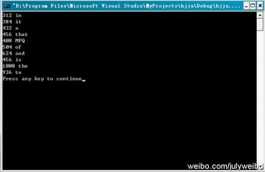

# 第三章续：搜索引擎热门查询统计


**题目描述**：
搜索引擎会通过日志文件把用户每次检索使用的所有检索串都记录下来，每个查询串的长度为1-255字节。  
假设目前有一千万个记录（这些查询串的重复度比较高，虽然总数是1千万，但如果除去重复后，不超过3百万个。一个查询串的重复度越高，说明查询它的用户越多，也就是越热门。），请你统计最热门的10个查询串，要求使用的内存不能超过1G。  

分析：这个问题在之前的这篇文章[十一、从头到尾彻底解析Hash表算法](http://blog.csdn.net/v_JULY_v/article/details/6256463)里，已经有所解答。方法是:    

**第一步**、先对这批海量数据预处理，在O(N)的时间内用Hash表完成统计；  
**第二步**、借助堆这个数据结构，找出Top K，时间复杂度为N‘logK。  
即，借助堆结构，我们可以在log量级的时间内查找和调整/移动。因此，维护一个K(该题目中是10)大小的小根堆（K1>K2>....Kmin，Kmin设为堆顶元素），然后遍历300万的Query，分别和根元素Kmin进行对比比较（如上第2节思路3所述，若X>Kmin，则更新并调整堆，否则，不更新），我们最终的时间复杂度是：O(N) + N'\*O(logK)，（N为1000万，N’为300万）。  

或者：采用trie树，关键字域存该查询串出现的次数，没有出现为0。最后用10个元素的最小推来对出现频率进行排序。  

ok，本章里，咱们来实现这个问题，为了降低实现上的难度，假设这些记录全部是一些英文单词，即用户在搜索框里敲入一个英文单词，然后查询搜索结果，最后，要你统计输入单词中频率最大的前K个单词。ok，复杂问题简单化了之后，编写代码实现也相对轻松多了，画的简单示意图（绘制者，yansha），如下：  


**完整源码**：

```c
//copyright@yansha &&July
//July、updated，2011.05.08

//题目描述：
//搜索引擎会通过日志文件把用户每次检索使用的所有检索串都记录下来，每个查询串的
//长度为1-255字节。假设目前有一千万个记录（这些查询串的重复度比较高，虽然总数是1千万，但如果
//除去重复后，不超过3百万个。一个查询串的重复度越高，说明查询它的用户越多，也就是越热门），
//请你统计最热门的10个查询串，要求使用的内存不能超过1G。

#include <iostream>
#include <stdio.h>
#include <string.h>
#include <assert.h>
using namespace std;

#define HASHLEN 2807303
#define WORDLEN 30

// 结点指针
typedef struct node_no_space *ptr_no_space;
typedef struct node_has_space *ptr_has_space;
ptr_no_space head[HASHLEN];

struct node_no_space
{
    char *word;
    int count;
    ptr_no_space next;
};

struct node_has_space
{
    char word[WORDLEN];
    int count;
    ptr_has_space next;
};

// 最简单hash函数
int hash_function(char const *p)
{
    int value = 0;
    while (*p != '\0')
    {
        value = value * 31 + *p++;
        if (value > HASHLEN)
            value = value % HASHLEN;
    }
    return value;
}

// 添加单词到hash表
void append_word(char const *str)
{
    int index = hash_function(str);
    ptr_no_space p = head[index];
    while (p != NULL)
    {
        if (strcmp(str, p->word) == 0)
        {
            (p->count)++;
            return;
        }
        p = p->next;
    }

    // 新建一个结点
    ptr_no_space q = new node_no_space;
    q->count = 1;
    q->word = new char [strlen(str)+1];
    strcpy(q->word, str);
    q->next = head[index];
    head[index] = q;
}


// 将单词处理结果写入文件
void write_to_file()
{
    FILE *fp = fopen("result.txt", "w");
    assert(fp);

    int i = 0;
    while (i < HASHLEN)
    {
        for (ptr_no_space p = head[i]; p != NULL; p = p->next)
            fprintf(fp, "%s  %d\n", p->word, p->count);
        i++;
    }
    fclose(fp);
}

// 从上往下筛选，保持小根堆
void sift_down(node_has_space heap[], int i, int len)
{
    int min_index = -1;
    int left = 2 * i;
    int right = 2 * i + 1;

    if (left <= len && heap[left].count < heap[i].count)
        min_index = left;
    else
        min_index = i;

    if (right <= len && heap[right].count < heap[min_index].count)
        min_index = right;

    if (min_index != i)
    {
        // 交换结点元素
        swap(heap[i].count, heap[min_index].count);

        char buffer[WORDLEN];
        strcpy(buffer, heap[i].word);
        strcpy(heap[i].word, heap[min_index].word);
        strcpy(heap[min_index].word, buffer);

        sift_down(heap, min_index, len);
    }
}

// 建立小根堆
void build_min_heap(node_has_space heap[], int len)
{
    if (heap == NULL)
        return;

    int index = len / 2;
    for (int i = index; i >= 1; i--)
        sift_down(heap, i, len);
}

// 去除字符串前后符号
void handle_symbol(char *str, int n)
{
    while (str[n] < '0' || (str[n] > '9' && str[n] < 'A') || (str[n] > 'Z' && str[n] < 'a') || str[n] > 'z')
    {
        str[n] = '\0';
        n--;
    }

    while (str[0] < '0' || (str[0] > '9' && str[0] < 'A') || (str[0] > 'Z' && str[0] < 'a') || str[0] > 'z')
    {
        int i = 0;
        while (i < n)
        {
            str[i] = str[i+1];
            i++;
        }
        str[i] = '\0';
        n--;
    }
}

int main()
{
    char str[WORDLEN];
    for (int i = 0; i < HASHLEN; i++)
        head[i] = NULL;

    // 将字符串用hash函数转换成一个整数并统计出现频率
    FILE *fp_passage = fopen("string.txt", "r");
    assert(fp_passage);
    while (fscanf(fp_passage, "%s", str) != EOF)
    {
        int n = strlen(str) - 1;
        if (n > 0)
            handle_symbol(str, n);
        append_word(str);
    }
    fclose(fp_passage);

    // 将统计结果输入文件
    write_to_file();

    int n = 10;
    ptr_has_space heap = new node_has_space [n+1];

    int c;

    FILE *fp_word = fopen("result.txt", "r");
    assert(fp_word);
    for (int j = 1; j <= n; j++)
    {
        fscanf(fp_word, "%s %d", &str, &c);
        heap[j].count = c;
        strcpy(heap[j].word, str);
    }

    // 建立小根堆
    build_min_heap(heap, n);

    // 查找出现频率最大的10个单词
    while (fscanf(fp_word, "%s %d", &str, &c) != EOF)
    {
        if (c > heap[1].count)
        {
            heap[1].count = c;
            strcpy(heap[1].word, str);
            sift_down(heap, 1, n);
        }
    }
    fclose(fp_word);

    // 输出出现频率最大的单词
    for (int k = 1; k <= n; k++)
        cout << heap[k].count << " " << heap[k].word << endl;

    return 0;
}
```

**程序测试**：咱们接下来，来对下面的通过用户输入单词后，搜索引擎记录下来，“大量”单词记录进行统计（同时，令K=10，即要你找出10个最热门查询的单词）：  


**运行结果**：根据程序的运行结果，可以看到，搜索引擎记录下来的查询次数最多的10个单词为（注，并未要求这10个数要有序输出）：in（312次），it（384次），a（432），that（456），MPQ（408），of（504），and（624），is（456），the（1008），to（936）。  



**读者反馈from 杨忠胜**：3.1节的代码第38行 hash_function(char const \*p)有误吧，这样的话，不能修改p的值（但是函数需要修改指针的值），要想不修改\*p指向的内容，应该是const char \*p; 此外，您程序中的/t,  /n有误，C语言是\\t,\\n。  
&emsp;&emsp;感谢这位读者的来信，日后统一订正。谢谢。  

###扩展、统计出现次数最多的数据

**题目描述**：
给你上千万或上亿数据（有重复），统计其中出现次数最多的前N个数据。  

分析：上千万或上亿的数据，现在的机器的内存应该能存下（也许可以，也许不可以）。所以考虑采用hash_map/搜索二叉树/红黑树等来进行统计次数。然后就是取出前N个出现次数最多的数据了。当然，也可以堆实现。  

ok，此题与上题类似，最好的方法是用hash_map统计出现的次数，然后再借用堆找出出现次数最多的N个数据。不过，上一题统计搜索引擎最热门的查询已经采用过hash表统计单词出现的次数，特此，本题咱们改用红黑树取代之前的用hash表，来完成最初的统计，然后用堆更新，找出出现次数最多的前N个数据。  
