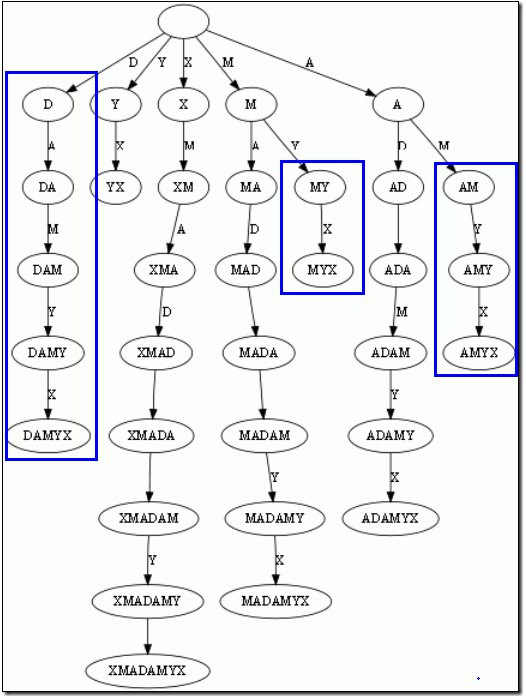
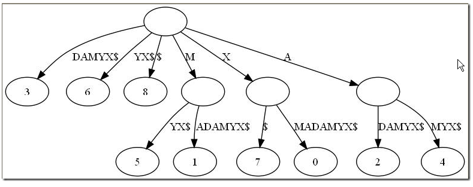

## 后缀树

### 1.1、后缀树的定义

后缀树（Suffix tree）是一种数据结构，能快速解决很多关于字符串的问题。后缀树的概念最早由Weiner 于1973年提出，既而由McCreight 在1976年和Ukkonen在1992年和1995年加以改进完善。

后缀，顾名思义，甚至通俗点来说，就是所谓后缀就是后面尾巴的意思。比如说给定一长度为n的字符串S=S1S2..Si..Sn，和整数i，1 <= i <= n，子串SiSi+1...Sn便都是字符串S的后缀。

以字符串S=XMADAMYX为例，它的长度为8，所以S[1..8], S[2..8], ... , S[8..8]都算S的后缀，我们一般还把空字串也算成后缀。这样，我们一共有如下后缀。对于后缀S[i..n]，我们说这项后缀起始于i。

S[1..8], XMADAMYX， 也就是字符串本身，起始位置为1  
 S[2..8], MADAMYX，起始位置为2  
  S[3..8], ADAMYX，起始位置为3  
   S[4..8], DAMYX，起始位置为4  
    S[5..8], AMYX，起始位置为5  
     S[6..8], MYX，起始位置为6  
      S[7..8], YX，起始位置为7  
       S[8..8], X，起始位置为8  
空字串，记为$。 

而后缀树，就是包含一则字符串所有后缀的压缩Trie。把上面的后缀加入Trie后，我们得到下面的结构：

仔细观察上图，我们可以看到不少值得压缩的地方。比如蓝框标注的分支都是独苗，没有必要用单独的节点同边表示。如果我们允许任意一条边里包含多个字 母，就可以把这种没有分叉的路径压缩到一条边。另外每条边已经包含了足够的后缀信息，我们就不用再给节点标注字符串信息了。我们只需要**在叶节点上标注上每项后缀的起始位置**。于是我们得到下图：

这样的结构丢失了某些后缀。比如后**缀X在上图中消失了**，因为它正好是字符串XMADAMYX的前缀。为了避免这种情况，我们也规定**每项后缀不能是其它后缀的前缀**。要解决这个问题其实挺简单，在**待处理的子串后加一个空字串**就行了。例如我们处理XMADAMYX前，先把XMADAMYX变为 XMADAMYX$，于是就得到suffix tree--后缀树了，如下图所示：

### 1.2、后缀树与回文问题的关联

那后缀树同最长回文有什么关系呢？我们得先知道两个简单概念：

- 最低共有祖先，**LCA**（Lowest Common Ancestor)，也就是任意两节点（多个也行）最长的共有前缀。比如下图中，节点7同节点1的共同祖先是节点5与节点10，但最低共同祖先是5。 查找LCA的算法是O(1)的复杂度，当然，代价是需要对后缀树做复杂度为O(n)的预处理。 

- 广义后缀树(Generalized Suffix Tree)。传统的后缀树处理一坨单词的所有后缀。广义后缀树存储任意多个单词的所有后缀。例如下图是单词**XMADAMYX与XYMADAMX的广义后缀 树**。注意我们需要区分不同单词的后缀，所以叶节点用不同的特殊符号与后缀位置配对。 

### 1.3、最长回文问题的解决

有了上面的概念，本文引言中提出的查找最长回文问题就相对简单了。咱们来回顾下引言中提出的回文问题的具体描述：找出给定字符串里的最长回文。例如输入XMADAMYX，则输出MADAM。

思维的突破点在于考察回文的半径，而不是回文本身。所谓半径，就是回文对折后的字串。比如回文MADAM 的半径为MAD，半径长度为3，半径的中心是字母D。显然，最长回文必有最长半径，且两条半径相等。还是以MADAM为例，以D为中心往左，我们得到半径 DAM；以D为中心向右，我们得到半径DAM。二者肯定相等。因为MADAM已经是单词XMADAMYX里的最长回文，我们可以肯定从**D往左数的字串 DAMX与从D往右数的子串DAMYX共享最长前缀DAM**。而这，正是解决回文问题的关键。现在我们有后缀树，怎么把从D向左数的字串DAMX变成后缀 呢？

到这个地步，答案应该明显：**把单词XMADAMYX翻转（XMADAMYX=>XYMADAMX**，**DAMX**就变成后缀了**）**就行了。于是我们把寻找回文的问题转换成了寻找两坨后缀的**LCA**的问题。当然，我们还需要知道 到底查询那些后缀间的LCA。很简单，给定字符串S，如果最长回文的中心在i，那从位置i向右数的后缀刚好是S(i)，而向左数的字符串刚好是翻转S后得到的字符串S‘的后缀S'(n-i+1)。这里的n是字符串S的长度。

可能上面的阐述还不够直观，我再细细说明下：

**1.** 首先，还记得本第二部分开头关于后缀树的定义么： “先说说后缀的定义，顾名思义，甚至通俗点来说，就是所谓后缀就是后面尾巴的意思。比如说给定一长度为n的字符串S=S1S2..Si..Sn，和整数i，**1 <= i <= n，子串SiSi+1...Sn便都是字符串S的后缀**。”  

以字符串S=XMADAMYX为例，它的长度为8，所以S[1..8], S[2..8], ... , S[8..8]都算S的后缀，我们一般还把空字串也算成后缀。这样，我们一共有如下后缀。对于后缀S[i..n]，我们说这项后缀起始于i。

S[1..8], XMADAMYX， 也就是字符串本身，起始位置为1  
 S[2..8], MADAMYX，起始位置为2  
  S[3..8], ADAMYX，起始位置为3  
   S[4..8], DAMYX，起始位置为4  
    S[5..8], AMYX，起始位置为5  
     S[6..8], MYX，起始位置为6  
      S[7..8], YX，起始位置为7  
       S[8..8], X，起始位置为8  
空字串，记为$。

**2.** 对单词XMADAMYX而言，回文中心为D，那么D向右的后缀**DAMYX**假设是S(i)（当N=8，i从1开始计数，i=4时，便是S(4..8)）;而对于翻转后的单词XYMADAMX而言，回文中心D向右对应的后缀为**DAMX**，也就是S'(N-i+1)(（N=8，i=4，便是S‘（5..8）） 。此刻已经可以得出，它们共享最长前缀，即**LCA（DAMYX，DAMX）=DAM**。有了这套直观解释，算法自然呼之欲出:

1. 预处理后缀树，使得查询LCA的复杂度为O(1)。这步的开销是O(N)，N是单词S的长度 ；
  
2. 对单词的每一位置i(也就是从0到N-1)，获取LCA(S(i), S‘(N-i+1)) 以及LCA(S(i+1), S’(n-i+1))。查找两次的原因是我们需要考虑奇数回文和偶数回文的情况。这步要考察每坨i，所以复杂度是O(N) ；  

3. 找到最大的LCA，我们也就得到了回文的中心i以及回文的半径长度，自然也就得到了最长回文。总的复杂度O(n)。 

用上图做例子，i为4时，LCA(4$, 5#)为DAM，正好是最长半径。当然，这只是直观的叙述。
    
上面大致描述了后缀树的基本思路。要想写出实用代码，至少还得知道下面的知识：

- 创建后缀树的O(n)算法。此算法有很多种，无论Peter Weiner的73年年度最佳算法，还是Edward McCreight1976的改进算法，还是1995年E. Ukkonen大幅简化的算法（本文第4部分将重点阐述这种方法），还是Juha Kärkkäinen 和 Peter Sanders2003年进一步简化的线性算法，都是O（n）的时间复杂度。至于实际中具体选择哪一种算法，可依实际情况而定。 
- 实现后缀树用的数据结构。比如常用的子结点加兄弟节点列表，Directed 优化后缀树空间的办法。比如不存储子串，而存储读取子串必需的位置。以及Directed Acyclic Word Graph，常缩写为黑哥哥们挂在嘴边的DAWG。 

### 1.4、后缀树的应用

后缀树的用途，总结起来大概有如下几种:

1. 查找字符串o是否在字符串S中。  
方案：用S构造后缀树，按在trie中搜索字串的方法搜索o即可。  
原理：若o在S中，则o必然是S的某个后缀的前缀。  
例如S: leconte，查找o: con是否在S中,则o(con)必然是S(leconte)的后缀之一conte的前缀.有了这个前提，采用trie搜索的方法就不难理解了。
2. 指定字符串T在字符串S中的重复次数。  
方案：用S+’$'构造后缀树，搜索T节点下的叶节点数目即为重复次数  
原理：如果T在S中重复了两次，则S应有两个后缀以T为前缀，重复次数就自然统计出来了。
3. 字符串S中的最长重复子串S1，比如abcdabcefda里abc同da都重复出现，而最长重复子串是abc。  
方案：原理同2，具体做法就是找到最深的非叶节点。
这个深是指从root所经历过的字符个数，最深非叶节点所经历的字符串起来就是最长重复子串。  
为什么要非叶节点呢?因为既然是要重复，当然叶节点个数要>=2。
4. 两个字符串S1，S2的最长公共部分  
方案：将S1#S2$作为字符串压入后缀树，找到最深的非叶节点，且该节点的叶节点既有#也有$(无#)。
5. 找出给定字符串里的最长回文。例子：输入XMADAMYX。则输出MADAM。
6. 查询字符串S是否包含子串S1。主要思想是：如果S包含S1，那么S1必定是S的某个后缀的前缀；又因为S的后缀树包含了所有的后缀，所以只需对S的后缀树使用和Trie相同的查找方法查找S1即可（使用后缀树实现的复杂度同流行的KMP算法的复杂度相当）。
7. 找出字符串S1同S2的最长公共子串。注意最长公共子串（Longest CommonSubstring）和最长公共子序列（LongestCommon Subsequence, LCS）的区别：子串（Substring）是串的一个连续的部分，子序列（Subsequence）则是从不改变序列的顺序，而从序列中去掉任意的元素而获得的新序列；更简略地说，前者（子串）的字符的位置必须连续，后者（子序列LCS）则不必。比如字符串acdfg同akdfc的最长公共子串为df，而他们的最长公共子序列是adf。LCS可以使用动态规划法解决。
Ziv-Lampel无损压缩算法。 LZW算法的基本原理是利用编码数据本身存在字符串重复特性来实现数据压缩，所以一个很好的选择是使用后缀树的形式来组织存储字符串及其对应压缩码值的字典。
8. 多模式串的模式匹配问题（suffix_array + 二分）。
