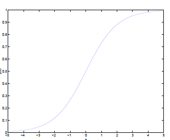

# 支持向量机通俗导论（理解SVM的三层境界）

##前言
动笔写这个支持向量机(support vector machine)是费了不少劲和困难的，原因很简单，一者这个东西本身就并不好懂，要深入学习和研究下去需花费不少时间和精力，二者这个东西也不好讲清楚，尽管网上已经有朋友写得不错了(见文末参考链接)，但在描述数学公式的时候还是显得不够。得益于同学白石的数学证明，我还是想尝试写一下，希望本文在兼顾通俗易懂的基础上，真真正正能足以成为一篇完整概括和介绍支持向量机的导论性的文章。

本文在写的过程中，参考了不少资料，包括《支持向量机导论》、《统计学习方法》及网友pluskid的支持向量机系列等等，于此，还是一篇学习笔记，只是加入了自己的理解和总结，有任何不妥之处，还望海涵。全文宏观上整体认识支持向量机的概念和用处，微观上深究部分定理的来龙去脉，证明及原理细节，力保逻辑清晰 & 通俗易懂。

同时，阅读本文时建议大家尽量使用chrome等浏览器，如此公式才能更好的显示，再者，阅读时可拿张纸和笔出来，把本文所有定理.公式都亲自推导一遍或者直接打印下来（可直接打印网页版或本文文末附的PDF，享受随时随地思考、演算的极致快感），在文稿上演算。

Ok，还是那句原话，有任何问题，欢迎任何人随时不吝指正 & 赐教，感谢。

##第一层、了解SVM
###*1.0、什么是支持向量机SVM*
要明白什么是SVM，便得从分类说起。

分类作为数据挖掘领域中一项非常重要的任务，它的目的是学会一个分类函数或分类模型(或者叫做分类器)，而支持向量机本身便是一种监督式学习的方法(至于具体什么是监督学习与非监督学习，请参见此系列[Machine L&Data Mining][id]第一篇)，它广泛的应用于统计分类以及回归分析中。

[id]:http://blog.csdn.net/v_july_v/article/category/1061301

支持向量机（SVM）是90年代中期发展起来的基于统计学习理论的一种机器学习方法，通过寻求结构化风险最小来提高学习机泛化能力，实现经验风险和置信范围的最小化，从而达到在统计样本量较少的情况下，亦能获得良好统计规律的目的。

通俗来讲，它是一种二类分类模型，其基本模型定义为特征空间上的间隔最大的线性分类器，即支持向量机的学习策略便是间隔最大化，最终可转化为一个凸二次规划问题的求解。

对于不想深究SVM原理的同学或比如就只想看看SVM是干嘛的，那么，了解到这里便足够了，不需上层。而对于那些喜欢深入研究一个东西的同学，甚至究其本质的，咱们则还有很长的一段路要走，万里长征，咱们开始迈第一步吧，相信你能走完。

###*1.1、线性分类*
OK，在讲SVM之前，咱们必须先弄清楚一个概念：线性分类器(也可以叫做感知机，这里的机表示的是一种算法，本文第三部分、证明SVM中会详细阐述)。

####1.1.1、分类标准
这里我们考虑的是一个两类的分类问题，数据点用 x 来表示，这是一个 n 维向量，w^T中的T代表转置，而类别用 y 来表示，可以取 1 或者 -1 ，分别代表两个不同的类。一个线性分类器的学习目标就是要在 n 维的数据空间中找到一个分类[超平面][a]，其方程可以表示为：

[a]:http://zh.wikipedia.org/wiki/%E8%B6%85%E5%B9%B3%E9%9D%A2

上面给出了线性分类的定义描述，但或许读者没有想过：为何用y取1 或者 -1来表示两个不同的类别呢？其实，这个1或-1的分类标准起源于logistic回归，为了完整和过渡的自然性，咱们就再来看看这个logistic回归。

####1.1.2、1或-1分类标准的起源：logistic回归
Logistic回归目的是从特征学习出一个0/1分类模型，而这个模型是将特性的线性组合作为自变量，由于自变量的取值范围是负无穷到正无穷。因此，使用logistic函数（或称作sigmoid函数）将自变量映射到(0,1)上，映射后的值被认为是属于y=1的概率。

形式化表示就是

假设函数

其中x是n维特征向量，函数g就是logistic函数。

而的图像是

可以看到，将无穷映射到了(0,1)。而假设函数就是特征属于y=1的概率。

 当我们要判别一个新来的特征属于哪个类时，只需求，若大于0.5就是y=1的类，反之属于y=0类。

再审视一下，发现只和有关，>0，那么>0.5，g(z)只不过是用来映射，真实的类别决定权还在。还有当>>0时，=1，反之=0。如果我们只从出发，希望模型达到的目标无非就是让训练数据中y=1的特征>>0，而是y=0的特征<<0。Logistic回归就是要学习得到，使得正例的特征远大于0，负例的特征远小于0，强调在全部训练实例上达到这个目标。

####1.1.3、形式化标示
 我们这次使用的结果标签是y=-1,y=1，替换在logistic回归中使用的y=0和y=1。同时将替换成w和b。以前的，其中认为。现在我们替换为b，后面替换为（即）。这样，我们让，进一步。也就是说除了y由y=0变为y=-1，只是标记不同外，与logistic回归的形式化表示没区别。
 
再明确下假设函数

上面提到过我们只需考虑的正负问题，而不用关心g(z)，因此我们这里将g(z)做一个简化，将其简单映射到y=-1和y=1上。映射关系如下：

于此，想必已经解释明白了为何线性分类的标准一般用1 或者-1 来标示。
    
注：上小节来自jerrylead所作的斯坦福机器学习课程的笔记。