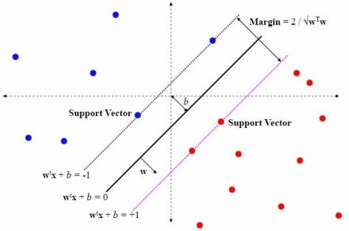

# 支持向量机通俗导论（理解SVM的三层境界）

##前言
动笔写这个支持向量机(support vector machine)是费了不少劲和困难的，原因很简单，一者这个东西本身就并不好懂，要深入学习和研究下去需花费不少时间和精力，二者这个东西也不好讲清楚，尽管网上已经有朋友写得不错了(见文末参考链接)，但在描述数学公式的时候还是显得不够。得益于同学白石的数学证明，我还是想尝试写一下，希望本文在兼顾通俗易懂的基础上，真真正正能足以成为一篇完整概括和介绍支持向量机的导论性的文章。

本文在写的过程中，参考了不少资料，包括《支持向量机导论》、《统计学习方法》及网友pluskid的支持向量机系列等等，于此，还是一篇学习笔记，只是加入了自己的理解和总结，有任何不妥之处，还望海涵。全文宏观上整体认识支持向量机的概念和用处，微观上深究部分定理的来龙去脉，证明及原理细节，力保逻辑清晰 & 通俗易懂。

同时，阅读本文时建议大家尽量使用chrome等浏览器，如此公式才能更好的显示，再者，阅读时可拿张纸和笔出来，把本文所有定理.公式都亲自推导一遍或者直接打印下来（可直接打印网页版或本文文末附的PDF，享受随时随地思考、演算的极致快感），在文稿上演算。

Ok，还是那句原话，有任何问题，欢迎任何人随时不吝指正 & 赐教，感谢。

##第一层、了解SVM
###*1.0、什么是支持向量机SVM*
要明白什么是SVM，便得从分类说起。

分类作为数据挖掘领域中一项非常重要的任务，它的目的是学会一个分类函数或分类模型(或者叫做分类器)，而支持向量机本身便是一种监督式学习的方法(至于具体什么是监督学习与非监督学习，请参见此系列[Machine L&Data Mining][id]第一篇)，它广泛的应用于统计分类以及回归分析中。

[id]:http://blog.csdn.net/v_july_v/article/category/1061301

支持向量机（SVM）是90年代中期发展起来的基于统计学习理论的一种机器学习方法，通过寻求结构化风险最小来提高学习机泛化能力，实现经验风险和置信范围的最小化，从而达到在统计样本量较少的情况下，亦能获得良好统计规律的目的。

通俗来讲，它是一种二类分类模型，其基本模型定义为特征空间上的间隔最大的线性分类器，即支持向量机的学习策略便是间隔最大化，最终可转化为一个凸二次规划问题的求解。

对于不想深究SVM原理的同学或比如就只想看看SVM是干嘛的，那么，了解到这里便足够了，不需上层。而对于那些喜欢深入研究一个东西的同学，甚至究其本质的，咱们则还有很长的一段路要走，万里长征，咱们开始迈第一步吧，相信你能走完。

###*1.1、线性分类*
OK，在讲SVM之前，咱们必须先弄清楚一个概念：线性分类器(也可以叫做感知机，这里的机表示的是一种算法，本文第三部分、证明SVM中会详细阐述)。

####1.1.1、分类标准
这里我们考虑的是一个两类的分类问题，数据点用 x 来表示，这是一个 n 维向量，w^T中的T代表转置，而类别用 y 来表示，可以取 1 或者 -1 ，分别代表两个不同的类。一个线性分类器的学习目标就是要在 n 维的数据空间中找到一个分类[超平面][a]，其方程可以表示为：

[a]:http://zh.wikipedia.org/wiki/%E8%B6%85%E5%B9%B3%E9%9D%A2

上面给出了线性分类的定义描述，但或许读者没有想过：为何用y取1 或者 -1来表示两个不同的类别呢？其实，这个1或-1的分类标准起源于logistic回归，为了完整和过渡的自然性，咱们就再来看看这个logistic回归。

####1.1.2、1或-1分类标准的起源：logistic回归
Logistic回归目的是从特征学习出一个0/1分类模型，而这个模型是将特性的线性组合作为自变量，由于自变量的取值范围是负无穷到正无穷。因此，使用logistic函数（或称作sigmoid函数）将自变量映射到(0,1)上，映射后的值被认为是属于y=1的概率。

形式化表示就是

假设函数

其中x是n维特征向量，函数g就是logistic函数。

而的图像是

可以看到，将无穷映射到了(0,1)。而假设函数就是特征属于y=1的概率。

 当我们要判别一个新来的特征属于哪个类时，只需求，若大于0.5就是y=1的类，反之属于y=0类。

再审视一下，发现只和有关，>0，那么>0.5，g(z)只不过是用来映射，真实的类别决定权还在。还有当>>0时，=1，反之=0。如果我们只从出发，希望模型达到的目标无非就是让训练数据中y=1的特征>>0，而是y=0的特征<<0。Logistic回归就是要学习得到，使得正例的特征远大于0，负例的特征远小于0，强调在全部训练实例上达到这个目标。

####1.1.3、形式化标示
 我们这次使用的结果标签是y=-1,y=1，替换在logistic回归中使用的y=0和y=1。同时将替换成w和b。以前的，其中认为。现在我们替换为b，后面替换为（即）。这样，我们让，进一步。也就是说除了y由y=0变为y=-1，只是标记不同外，与logistic回归的形式化表示没区别。
 
再明确下假设函数

上面提到过我们只需考虑的正负问题，而不用关心g(z)，因此我们这里将g(z)做一个简化，将其简单映射到y=-1和y=1上。映射关系如下：

于此，想必已经解释明白了为何线性分类的标准一般用1 或者-1 来标示。
    
注：上小节来自jerrylead所作的斯坦福机器学习课程的笔记。

###*1.2、线性分类的一个例子*
下面举个简单的例子，一个二维平面(一个超平面，在二维空间中的例子就是一条直线)，如下图所示，平面上有两种不同的点，分别用两种不同的颜色表示，一种为红颜色的点，另一种则为蓝颜色的点，红颜色的线表示一个可行的超平面。

 从上图中我们可以看出，这条红颜色的线把红颜色的点和蓝颜色的点分开来了。而这条红颜色的线就是我们上面所说的超平面，也就是说，这个所谓的超平面的的确确便把这两种不同颜色的数据点分隔开来，在超平面一边的数据点所对应的 y 全是 -1 ，而在另一边全是 1 。

接着，我们可以令分类函数（提醒：下文很大篇幅都在讨论着这个分类函数）：

显然，如果 f(x)=0 ，那么 x 是位于超平面上的点。我们不妨要求对于所有满足 f(x)<0 的点，其对应的 y 等于 -1 ，而 f(x)>0 则对应 y=1 的数据点。

 注：上图中，定义特征到结果的输出函数，与我们之前定义的实质是一样的。为什么？因为无论是，还是，不影响最终优化结果。下文你将看到，当我们转化到优化的时候，为了求解方便，会把yf(x)令为1，即yf(x)是y(w^x + b)，还是y(w^x - b)，对我们要优化的式子max1/||w||已无影响。
    （有一朋友飞狗来自Mare_Desiderii，看了上面的定义之后，问道：请教一下SVM functional margin 为=y(wTx+b)=yf(x)中的Y是只取1和-1 吗？y的唯一作用就是确保functional margin的非负性？真是这样的么？当然不是，详情请见本文评论下第43楼）

当然，有些时候，或者说大部分时候数据并不是线性可分的，这个时候满足这样条件的超平面就根本不存在(不过关于如何处理这样的问题我们后面会讲)，这里先从最简单的情形开始推导，就假设数据都是线性可分的，亦即这样的超平面是存在的。

更进一步，我们在进行分类的时候，将数据点 x代入 f(x) 中，如果得到的结果小于 0 ，则赋予其类别 -1 ，如果大于 0 则赋予类别 1 。如果 f(x)=0，则很难办了，分到哪一类都不是。

 请读者注意，下面的篇幅将按下述3点走：

1. 咱们就要确定上述分类函数f(x) = w.x + b（w.x表示w与x的内积）中的两个参数w和b，通俗理解的话w是法向量，b是截距（再次说明：定义特征到结果的输出函数，与我们最开始定义的实质是一样的）；

2. 那如何确定w和b呢？答案是寻找两条边界端或极端划分直线中间的最大间隔（之所以要寻最大间隔是为了能更好的划分不同类的点，下文你将看到：为寻最大间隔，导出1/2||w||^2，继而引入拉格朗日函数和对偶变量a，化为对单一因数对偶变量a的求解，当然，这是后话），从而确定最终的最大间隔分类超平面hyper plane和分类函数；

3. 进而把寻求分类函数f(x) = w.x + b的问题转化为对w，b的最优化问题，最终化为对偶因子的求解。

总结成一句话即是：从最大间隔出发（目的本就是为了确定法向量w），转化为求对变量w和b的凸二次规划问题。亦或如下图所示（有点需要注意，如读者@酱爆小八爪所说：从最大分类间隔开始，就一直是凸优化问题）：

###*1.3、函数间隔Functional margin与几何间隔Geometrical margin*
 一般而言，一个点距离超平面的远近可以表示为分类预测的确信或准确程度。

* 在超平面w\*x+b=0确定的情况下，|w\*x+b|能够相对的表示点x到距离超平面的远近，而w\*x+b的符号与类标记y的符号是否一致表示分类是否正确，所以，可以用量y\*(w\*x+b)的正负性来判定或表示分类的正确性和确信度。

于此，我们便引出了定义样本到分类间隔距离的函数间隔functional margin的概念。

####1.3.1、函数间隔Functional margin
 我们定义函数间隔functional margin 为： 

接着，我们定义超平面(w，b)关于训练数据集T的函数间隔为超平面(w，b)关于T中所有样本点(xi，yi)的函数间隔最小值，其中，x是特征，y是结果标签，i表示第i个样本，有：

  = mini  (i=1，...n)

然与此同时，问题就出来了。上述定义的函数间隔虽然可以表示分类预测的正确性和确信度，但在选择分类超平面时，只有函数间隔还远远不够，因为如果成比例的改变w和b，如将他们改变为2w和2b，虽然此时超平面没有改变，但函数间隔的值f(x)却变成了原来的2倍。

其实，我们可以对法向量w加些约束条件，使其表面上看起来规范化，如此，我们很快又将引出真正定义点到超平面的距离--几何间隔geometrical margin的概念（很快你将看到，几何间隔就是函数间隔除以个||w||，即yf(x) / ||w||）。

####1.3.2、点到超平面的距离定义：几何间隔Geometrical margin

在给出几何间隔的定义之前，咱们首先来看下，如上图所示，对于一个点 x ，令其垂直投影到超平面上的对应的为 x0 ，由于 w 是垂直于超平面的一个向量，为样本x到分类间隔的距离，我们有

							
（||w||表示的是范数，关于范数的概念参见[这里][c]）

[c]:http://baike.baidu.com/view/637132.htm

又由于 x0 是超平面上的点，满足 f(x0)=0 ，代入超平面的方程即可算出： 

（有的书上会写成把||w|| 分开相除的形式，如本文参考文献及推荐阅读条目11，其中，||w||为w的二阶泛数）

不过这里的是带符号的，我们需要的只是它的绝对值，因此类似地，也乘上对应的类别 y即可，因此实际上我们定义 几何间隔geometrical margin 为(注：别忘了，上面的定义，=y(wTx+b)=yf(x) )：

（代人相关式子可以得出：yi*(w/||w|| + b/||w||)）

正如本文评论下读者popol1991留言：函数间隔y*(wx+b)=y*f(x)实际上就是|f(x)|，只是人为定义的一个间隔度量；而几何间隔|f(x)|/||w||才是直观上的点到超平面距离。

想想二维空间里的点到直线公式：假设一条直线的方程为ax+by+c=0,点P的坐标是(x0,y0)，则点到直线距离为|ax0+by0+c|/sqrt(a^2+b^2)。如下图所示：

                                 
那么如果用向量表示，设w=(a,b),f(x)=wx+c,那么这个距离正是|f(p)|/||w||。

###*1.4、最大间隔分类器Maximum Margin Classifier的定义*
于此，我们已经很明显的看出，函数间隔functional margin 和 几何间隔geometrical margin 相差一个的缩放因子。按照我们前面的分析，对一个数据点进行分类，当它的 margin 越大的时候，分类的 confidence 越大。对于一个包含 n 个点的数据集，我们可以很自然地定义它的 margin 为所有这 n 个点的 margin 值中最小的那个。于是，为了使得分类的 confidence 高，我们希望所选择的超平面hyper plane 能够最大化这个 margin 值。

通过上节，我们已经知道：

1. functional margin 明显是不太适合用来最大化的一个量，因为在 hyper plane 固定以后，我们可以等比例地缩放 w 的长度和 b 的值，这样可以使得的值任意大，亦即 functional margin可以在 hyper plane 保持不变的情况下被取得任意大，

2. 而 geometrical margin 则没有这个问题，因为除上了这个分母，所以缩放 w 和 b 的时候的值是不会改变的，它只随着 hyper plane 的变动而变动，因此，这是更加合适的一个 margin 。

这样一来，我们的 maximum margin classifier 的目标函数可以定义为：

当然，还需要满足一些条件，根据 margin 的定义，我们有

其中 (等价于= /||w||，故有稍后的  =1 时，  = 1 / ||w||)，处于方便推导和优化的目的，我们可以令=1(对目标函数的优化没有影响，至于为什么，请见本文评论下第42楼回复) ，此时，上述的目标函数转化为(其中，s.t.，即subject to的意思，它导出的是约束条件)：

通过求解这个问题，我们就可以找到一个 margin 最大的 classifier ，如下图所示，中间的红色线条是 Optimal Hyper Plane ，另外两条线到红线的距离都是等于的(便是上文所定义的geometrical margin，当令=1时，便为1/||w||，而我们上面得到的目标函数便是在相应的约束条件下，要最大化这个1/||w||值)：

通过最大化 margin ，我们使得该分类器对数据进行分类时具有了最大的 confidence，从而设计决策最优分类超平面。

###*1.5、到底什么是Support Vector*
 上节，我们介绍了Maximum Margin Classifier，但并没有具体阐述到底什么是Support Vector，本节，咱们来重点阐述这个概念。咱们不妨先来回忆一下上节1.4节最后一张图：

可以看到两个支撑着中间的 gap 的超平面，它们到中间的纯红线separating hyper plane 的距离相等，即我们所能得到的最大的 geometrical margin，而“支撑”这两个超平面的必定会有一些点，而这些“支撑”的点便叫做支持向量Support Vector。

或亦可看下来自此[PPT][b]中的一张图，Support Vector便是那蓝色虚线和粉红色虚线上的点：

[b]:http://ijcai13.org/files/tutorial_slides/te2.pdf

很显然，由于这些 supporting vector 刚好在边界上，所以它们满足（还记得我们把 functional margin 定为 1 了吗？上节中：“处于方便推导和优化的目的，我们可以令=1”），而对于所有不是支持向量的点，也就是在“阵地后方”的点，则显然有。当然，除了从几何直观上之外，支持向量的概念也可以从下文优化过程的推导中得到。

OK，到此为止，算是了解到了SVM的第一层，对于那些只关心怎么用SVM的朋友便已足够，不必再更进一层深究其更深的原理。
